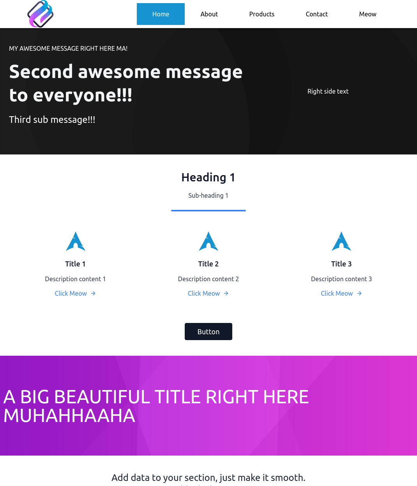

# Svelte template

Learning how to build applications with Svelte and wanted to share this template. Will use this for future personal projects, but need to do some cleanup, add tests, migrate JavaScript files to TypeScript..etc

Modern build process with Svelte, WebPack, PurgeCSS, code splitting, lazy loading...etc




[View Demo](https://source-285017.uc.r.appspot.com/)

## Quick start

```
yarn install
yarn dev
yarn test
```

### What if I want to use the minimal Svelte template instead?

Execute the helper script from the repo root.

```
node scripts/useDefaultSvelteTemplate.js
```

## Deploying

Production build assets are stored in `public/dist`  
Static assets can be deployed to any server that supports it. Should be just as easy to deploy to other static host providers like AWS, Netlify, or Firebase.

Google App Engine example configuration stored in `app.yaml` and deployed to the demo URL.

## Goals

1. Use web dev best practices
2. Improve TypeScript
3. Keep [PageSpeed](https://developers.google.com/speed/pagespeed/insights/?url=https%3A%2F%2Fsource-285017.uc.r.appspot.com%2F) score > 90

- Current score is 100, but need to make it real by adding services, logging..etc and use that score

## Features

- Svelte with TypeScript
- WebPack
- TailwindCSS
- PostCSS: Autoprefixer, PurgeCSS
- Code splitting
- Lazy loading
- GitHub actions to run build and Cypress tests

## TODO

- [ ] Cleanup unused packages
- [ ] Add unit tests
- [ ] Add integration tests
- [ ] Add visual regression tests
- [ ] Add performance tests
- [ ] Add accessibility tests
- [ ] Add more pages
- [ ] Add real API services
- [ ] Update documentation
- [ ] Create virtual scroller
- [ ] Migrate Javascript modules to TypeScript

## Contributions welcome

Would be great if anyone wanted to help with the items in TODO!
